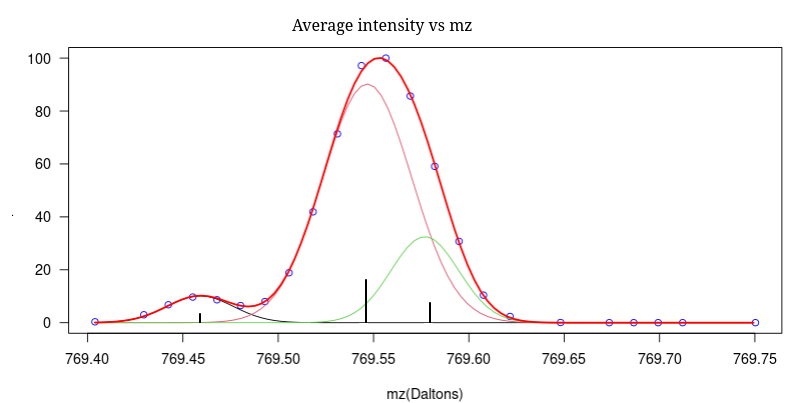

>rPPGAS is an R package oriented to the field of mass spectrometry and focused on image processing (MSI).
Its purpose is to generate a peak matrix from the information provided by a spectrometer in imzML format.
Specifically, it is a new peak picking algorithm that achieves two goals: high centroid accuracy and the detection of centroids that might otherwise remain hidden.



## Installation

> devtools::install_github("EdelCastillo/rPPGAS")

> Please note that is a development version and no release has been made yet. So, keep looking at this page for future updates and releases.

## Use guide


### **Step 1**.- A list with the necessary parameters is generated.

> For **example**:  
>params\ <-list("massResolution"=30000, "minPixelsSupport"=5, "SNR"=3,  "SNRmethod"="estnoise_mad");

**Description of the parameters:**

```         
massResolution:     Desired mass resolution for the peak matrix (mz/delta_mz).
minPixelSupport:    Minimum percentage of pixels that must provide intensity information for each mass (mz).
                    That is, in the peak matrix, the relative number of pixels with non-zero intensity must be equal to or greater than this.
SNR:                Signal-to-noise ratio. Discards information based on its proximity to the estimated noise level.
noiseMethod:        Procedure used for noise estimation:
                      estnoise_diff:  Average of the absolute differences with respect to the mean value.
                      estnoise_sd:    Standard deviation of the absolute differences (Gaussian filter).
                      estnoise_mad:   Median of the absolute deviations (Gaussian filter).
```

### **Step 2**.- The peak-picking algorithm is applied and its peak matrix is obtained:

> pMatrix <-getPeakMatrix(imzML_file_path, params, initMass, finalMass, nThreads)

**Description of the parameters:**   
```
imzML_file_path: Absolute path to the filename with the imzML extension.
                 The attached binary file, with the ibd extension, must be in the same directory.
         params: List of parameters given in Step 1.
       initMass: Initial mass to consider.
      finalMass: Final   mass to consider.
       nThreads: Number of threads for parallel processing (if zero, nThreads=maxCores-1)

  return a list: 
    peakMatrix: Matrix of peak (centroids) rows = pixels, columns = intensity of each pixel.
          mass: Vector with the masses associated with each column of peakMatrix.
massResolution: Vector with the mass resolution achieved in the peak matrix (mz/delta_mz).
 pixelsSupport: Vector with the number of pixels in each column with non-zero intensity.
```
